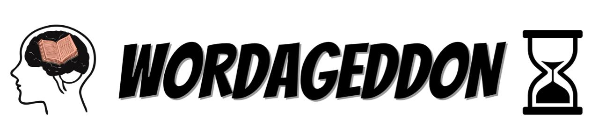

# Wordageddon

Wordageddon è un'applicazione Java per quiz linguistici basata su documenti di testo in italiano e inglese. Permette la gestione di documenti, stopwords, utenti (con ruoli), sessioni di gioco e statistiche.

## Struttura del progetto

- **WordageddonG3/**: Codice sorgente principale (`src/`), file di configurazione, build e risorse.
- **DocumentFolder/**: Contiene i documenti di testo suddivisi per lingua (`ita/`, `eng/`).
- **stopwords-it.txt**, **stopwords-en.txt**: Liste di stopwords per italiano e inglese.
- **wordageddon.db**: Database dell'applicazione.
- **WordageddonG3.jar**: Eseguibile dell'applicazione.
- **javadoc/**: Documentazione JavaDoc generata.
- **Documentazione/**: Relazione, diagrammi e mockup.
- **privacy_info/**: Informative privacy.

## Funzionalità principali

- **Gestione documenti**: Caricamento, visualizzazione e organizzazione di testi in italiano e inglese.
- **Quiz automatici**: Generazione di domande casuali su frequenza, confronto, esclusione e associazione parola-documento.
- **Gestione utenti**: Registrazione, login, ruoli (USER/ADMIN).
- **Storico e statistiche**: Visualizzazione e esportazione dei punteggi delle sessioni.
- **Configurazione**: Percorsi personalizzabili per documenti e stopwords.

## Requisiti

- Java 8 o superiore
- (Facoltativo) NetBeans o altro IDE Java

## Come eseguire

1. **Compilazione**  
   Da terminale nella cartella `WordageddonG3/WordageddonG3`:
   ```sh
   javac -d build/classes -sourcepath src src/wordageddon/Main.java
   ```

2. **Esecuzione**  
   ```sh
   java -jar WordageddonG3.jar
   ```
## Modalità admin
Per entrare nella modalità di amministratore, bisogna fare il login con username "admin" e password "admin". Così è possibile aggiungere nuovi documenti e cambiare i file per le stopwords.

## Documentazione

- **JavaDoc**: consultabile in [javadoc/index.html](javadoc/index.html)
- **Relazione**: in [Documentazione/Relazione Wordageddon G3.pdf](Documentazione/Relazione%20Wordageddon%20G3.pdf)
- **Diagrammi**: in [Documentazione/Diagrammi/](Documentazione/Diagrammi/)

## 👨‍💻 Componenti

| Nome                     | Matricola      | Email                                      |
|--------------------------|---------------|---------------------------------------------|
| Adinolfi Giovanni        | 0612708352    | g.adinolfi39@studenti.unisa.it              |
| Di Crescenzo Francesco   | 0612708640    | f.dicrescenzo2@studenti.unisa.it            |
| Di Marino Domenico       | 0612707421    | d.dimarino8@studenti.unisa.it               |
| Franchetti Carlo Maria   | 0612708665    | c.franchetti@studenti.unisa.it              |

## Licenza

> Progetto universitario per il corso di Programmazione Java Avanzata, Università degli Studi di Salerno.
